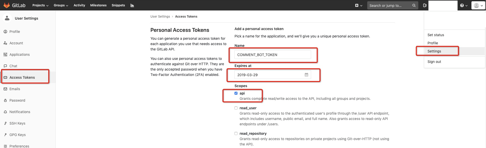
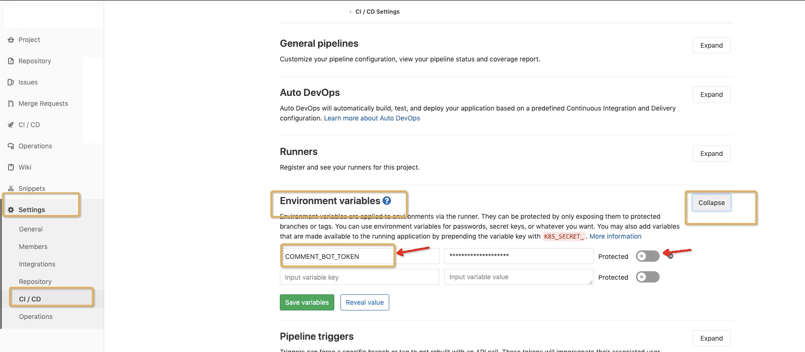
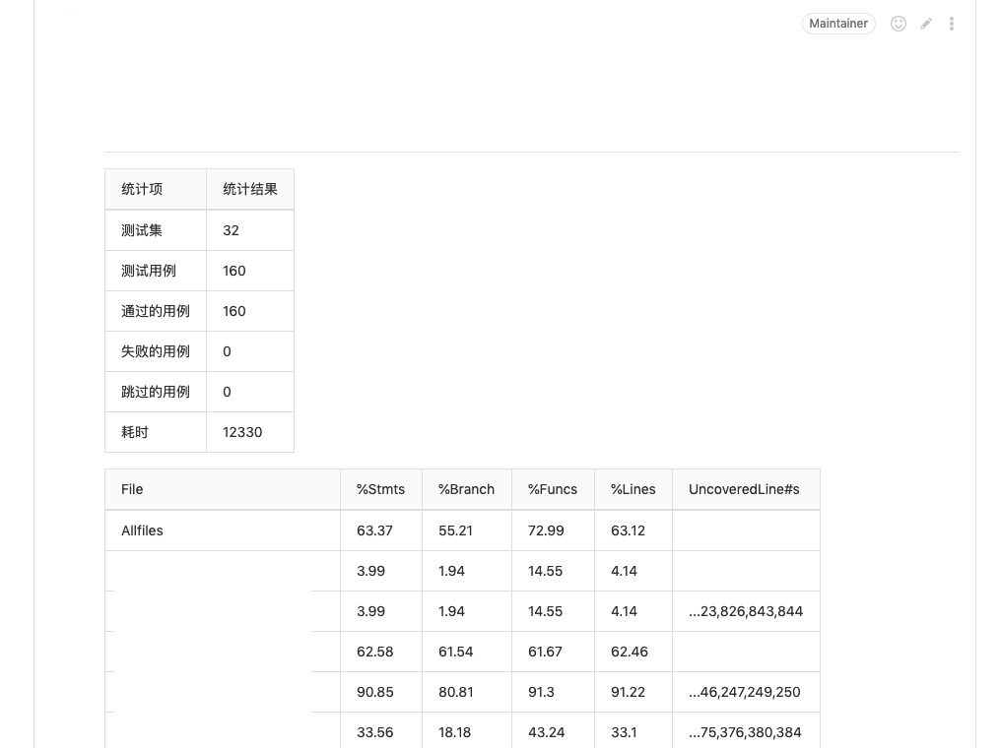

# 测试报告

既然已经测试了，那么我们需要可以方便查看测试报告的方式。本篇将和大家一起将测试结果与 CI 结合。


## 测试报告有哪些

- 测试状态报告，即测试用例是否全部通过，未通过的用例有哪些
- 测试覆盖率报告，每个通过的测试其对应的测试代码覆盖率


## CI 对接

#### 生成并配置评论用项目级 TOKEN
1. 项目管理人员去个人的设置页面生成一个 token，提供给评论用。参考下图示例，点击生成后在顶部会提供一个新生成的 token， 点击复制按钮。




2. 到项目的gitlab CI/CD配置页面，使用刚才生成复制好的 token 新建一个 COMMENT_BOT_TOKEN。（虽然这里名字是 COMMENT_BOT_TOKEN，但实际评论时是上面生成 token 的用户，名字统一为 COMMENT_BOT_TOKEN 是为了方便）




#### 报告生成

首先我们使用 cypress 和 mochawesome 来生成测试状态报告， 文档可以查看 [reporters](https://docs.cypress.io/guides/tooling/reporters.html#Spec-to-STDOUT-produce-a-combined-Mochawesome-JSON-file)

按文档配置好 cypress.json, 之后我们配置下 package.json 内的 npm 任务, 我们新增了 'test-report' 来合并 cypress 报告

```json
  "scripts": {
    "test": "rm -rf coverage && start-server-and-test serve :10880 cy:run",
    "cy:run": "cypress run --browser=chrome",
    "cy:open": "cypress open",
    "serve": "webpack-dev-server --hot --config webpack.dev.js",
    "coverage": "nyc report | tee coverage-report.md",
    "check-coverage": "nyc check-coverage",
    "test-report": "mochawesome-merge --reportDir cypress/results > mochawesome.json"
  },
```

#### 报告上报

我们新建一个 node 脚本来处理上面生成的 json 报告，并且合并 coverage 报告，然后使用 codeReviewBot 提供的接口上报到gitlab并在对应的 MR 页面评论里输出报告.

报告处理脚本 mochawesome-reporter.js

```javascript
#!/usr/bin/env node

const querystring = require('querystring');
const https = require('https');
const fs = require('fs');

const reportData = require('./mochawesome.json');

const stats = reportData.stats;

const summary = `
统计项 | 统计结果
---|---
测试集 | ${stats.suites}
测试用例 | ${stats.tests}
通过的用例 | ${stats.passes}
失败的用例 | ${stats.failures}
跳过的用例 | ${stats.skipped}
耗时 | ${stats.duration}ms

`;

let coverageData = fs.readFileSync('./coverage-report.md', {
  encoding: 'utf-8'
});
const coverageDataArr = coverageData.split('\n');
coverageData = coverageDataArr.slice(1, coverageDataArr.length - 2).join('\n').replace(/ /g, '');
const data = {
  body: summary + coverageData,
};

const {
  COMMENT_BOT_TOKEN,
  CI_MERGE_REQUEST_PROJECT_ID,
  CI_MERGE_REQUEST_IID,
} = process.env;

////////////////////
//  POST COMMENT  //
////////////////////

const postData = querystring.stringify(data);

const options = {
  hostname: 'gitlab.example.com',
  port: 443,
  path: `/api/v4/projects/${CI_MERGE_REQUEST_PROJECT_ID}/merge_requests/${CI_MERGE_REQUEST_IID}/discussions`,
  method: 'POST',
  headers: {
    'Content-Type': 'application/x-www-form-urlencoded',
    'Content-Length': Buffer.byteLength(postData),
    'PRIVATE-TOKEN': COMMENT_BOT_TOKEN
  }
};

const req = https.request(options, (res) => {
  console.log(`STATUS: ${res.statusCode}`);
  console.log(`HEADERS: ${JSON.stringify(res.headers)}`);
  res.setEncoding('utf8');
  res.on('data', (chunk) => {
    console.log(`BODY: ${chunk}`);
  });
  res.on('end', () => {
    console.log('No more data in response.');
  });
});

req.on('error', (e) => {
  console.error(`problem with request: ${e.message}`);
});

req.write(postData);
req.end();
```

.gitlab-ci.yml 配置示例


```yaml
stages:
  - test

cache:
  key: "$CI_BUILD_REF_NAME"
  paths:
    - .npm
    - node_modules

test-cypress:
  stage: test
  only:
    refs:
      - merge_requests
  script:
    - npm --registry=https://registry.npm.taobao.org ci
    - $(npm bin)/cypress verify
    - rm -rf mochawesome-report cypress/results mochawesome.json coverage-report.md
    - npm run test || echo 'test completed and error ignored'
    - npm run coverage
    - npm run test-report
    - echo 'sending report to CODEREVIEW_BOT_NOTE...'
    - node mochawesome-reporter.js
  tags:
    - ci
```

#### 报告输出结果示例




## CI 的 junit 对接（本方案需要 gitlab MR 界面能正常显示 junit 报告）
junit 是一个测试框架，其提出了一种以 xml 格式来输出测试结果报告的方式， gitlab ci 集成了可以收集测试结果并生成测试报告的工具， 具体查看 https://docs.gitlab.com/ee/ci/junit_test_reports.html


#### 测试状态报告
我们这里以 cypress 测试框架为例，说明如何接入 junit。

由于 cypress 已经为我们考虑了测试结果报告输出，其报告输出可以选择 junit 的格式。 文档参考 https://docs.cypress.io/guides/tooling/reporters.html#Reporter-Options

因此只需按文档所示，配置 cypress 输出报告即可。这里需要注意，由于 cypress 隔离执行各个测试用例，因此输出报告会相互覆盖，因此我们需要配置其使用hash来区分每个测试用例的报告。


配置示例如下

```json
{
    "baseUrl": "http://localhost:10880",
    "coverageFolder": "coverage",
    "reporter": "junit",
    "reporterOptions": {
        "mochaFile": "junit/report-[hash].xml",
        "toConsole": false
    },
    "integrationFolder": "src",
    "testFiles": "**/*.cypress.spec.js",
    "video": false,
    "viewportHeight": 900,
    "viewportWidth": 1600
} 
```


由于此方式会输出多份分开的报告，因此为了 CI 能正常处理，我们需要整合所有报告，输出一份完整的报告。我们写一份脚本来处理 junit-reporter.js

```javascript
#!/usr/bin/env node

// merge junit reports generated by cypress
const merger = require('junit-report-merger');
const fs = require('fs');
const rimraf = require('rimraf');
const junitFolder = './junit';
const files = fs.readdirSync(junitFolder).map(file => junitFolder + '/' + file);
merger.mergeFiles('junit-report.xml', files, null, function() {
    // clean up junit folder
    rimraf(junitFolder, function() { });
});
 ```
 


最后是需要配置 .gitlab-ci.yml， 指定其读取我们生成的报告。 示例如下

```yaml
stages:
  - test

test:
  stage: test
  only:
    - test
  script:
    - npm --registry=https://registry.npm.taobao.org install
    - npm run test
    - node junit-reporter.js
    - npm run coverage
  artifacts:
    reports:
      junit: ./junit-report.xml
```
